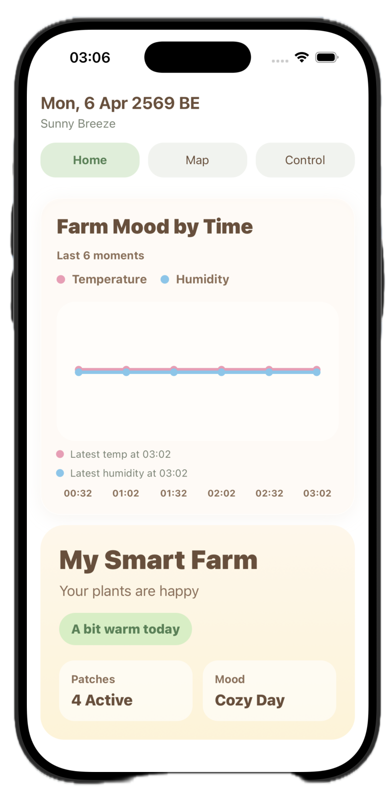
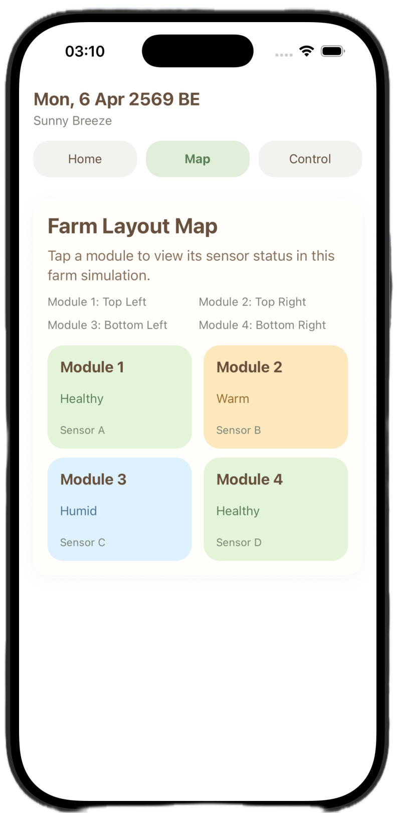
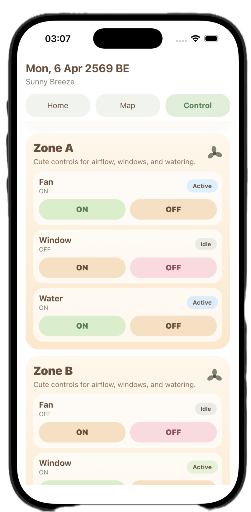

# 🌿 Agri Microclimate Airflow Optimization System

 Hackathon Project — Extending CMU Research into a Self-Powered Smart Farm System


## 🧠 Overview

This project is an **IoT-based smart farm system** designed to monitor and optimize environmental conditions inside a greenhouse.

It detects:

1. Temperature hotspots
2. Humidity pockets
3. Poor airflow zones

and enables **intelligent airflow optimization** using a distributed sensor network.


## 🔬 Project Background (Hackathon Context)

This project was developed as part of a **hackathon challenge**:

> Transform research into a real-world product

We selected a research topic related to **carbon-based solar cells (CPSC / perovskite concept)** and explored how it could be applied beyond energy generation.


## 🔬 Research Foundation (Chiang Mai University)

This project is inspired by research from **Chiang Mai University (CMU)** on:

> Carbon-based Perovskite Solar Cells

Key findings from the research:

1. Carbon electrodes replace expensive metals (Au, Ag)
2. Lower cost + higher stability
3. Good electrical conductivity
4. Natural resistance to moisture

A technique called: Ethanol Solvent Interlacing 

improves:

1. Flexibility of carbon films
2. Electrical performance
3. Device stability

 Reported Results:

1.  Efficiency ≈ 12.2%
2.  Stability ≈ 80% after 1000 hours


## 🚀 Our Innovation

While the research focuses on **solar cell materials**, we extend it into:

> 🌱 A self-powered smart farm system

We integrate:

1. Renewable energy concept (CPSC-inspired)
2. IoT sensor network
3. Real-time environmental intelligence


## 💡 Key Insight

> “Energy systems should not only supply power — they should enable smarter environments.”


## 🏗️ System Architecture

```text
[ Sensor Nodes ]
   ↓ (Temperature / Humidity)
   ↓ LoRa
[ Gateway ]
   ↓
[ Data Processing / Logic ]
   ↓
[ Mobile Dashboard App ]
```

## Components

1. Sensor Nodes : Measure temperature & humidity, Low-power design
2. Gateway : Receives LoRa data, Detects hotspots & anomalies
3. Processing Layer : Zone-based analysis, Airflow optimization logic
4. Mobile Dashboard : Real-time visualization, Interactive farm UI


## 🌱 Use Cases  
> Greenhouse farming , Hydroponics systems , Precision agriculture , Climate-sensitive crops


## 🏆 Hackathon Value

This project demonstrates:

1. Research → Product translation
2. Renewable energy integration
3. IoT system design
4. Full-stack + embedded system


## 📚 References

This project is inspired by research from Chiang Mai University:

Passatorntaschakorn et al. (2021)
Room-temperature carbon electrodes with ethanol solvent interlacing process for efficient and stable planar hybrid perovskite solar cells
Energy Reports, 7, 2493–2500
https://doi.org/10.1016/j.egyr.2021.04.031


## 👨‍💻 Author

** Neolemoz (Ciel) **
Robotics & AI Engineering Student
Chiang Mai University


## ✨ Tagline

> “From energy generation → to intelligent environmental control”


## 💕 Acknowledgments

This project was developed collaboratively during a hackathon.

Special thanks to all team members for:

- System design and architecture discussions  
- Implementation across frontend, backend, and embedded systems  
- Problem-solving under time constraints  

This project reflects the collective effort, resilience, and creativity of the team.


## ⊹ ࣪ ˖ Smart Farm Dashboard ⋆˚✿˖°

<p align="center">
  
  
  
</p>
